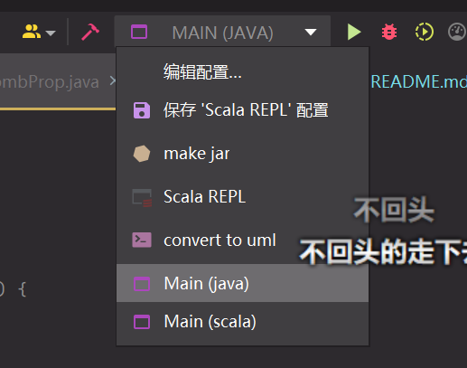
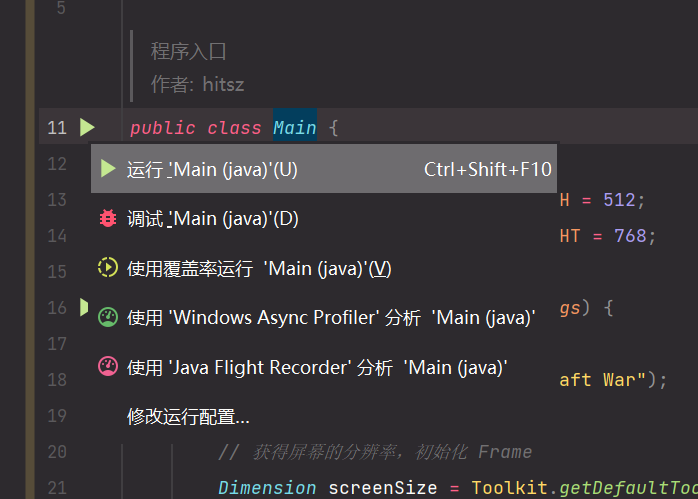

# Aircraft-War

## 说明

本项目已分为 Scala、Java 两独立部分，Java 部分完成课程基本要求，Scala 部分想在完成课程基础上做点奇怪东西……

对助教的话：如果可以用 Scala 直接交的话请告诉我，不胜感激😭。

## UML

Scala 项目的 UML 图见 [AircraftWar-scala.puml](uml/AircraftWar-scala.puml)，Java 项目的 UML 图见 [AircraftWa-java.puml](uml/AircraftWar-java.puml)。

*图片不够大...*

## 运行

### 直接运行编译好的 Jar 文件

如果您是助教，我已经将 Scala 的程序编译打包为单个`.jar`文件，直接双击 `run_jar.bat`即可运行。

### 运行 Scala

1. 使用 IDEA 打开项目文件夹（即此 `README.md` 文件所在文件夹）

2. IDEA 安装 Scala 插件

   

3. 重启 IDEA 并且重新打开文件夹，等待 IDEA 加载 sbt 完成

4. 如果运行配置中有这一项：

   1. 运行这一项（`Main (scala)`）即可

5. 如果运行配置中没有这一项

   1. 打开 `AircraftWar/src/main/scala/work/chiro/game/application/Main.scala`

   2. 点击三角形运行

      

      

### 运行 Java

1. 使用 IDEA 打开项目文件夹（即此 `README.md` 文件所在文件夹）

2. 等待 IDEA 加载 sbt 完成

3. 如果运行配置中有这一项：

   1. 运行这一项（`Main (java)`）即可

4. 如果运行配置中没有这一项

   1. 打开 `AircraftWar/src/main/scala/edu/hitsz/application/Main.java`

   2. 点击三角形运行

      

