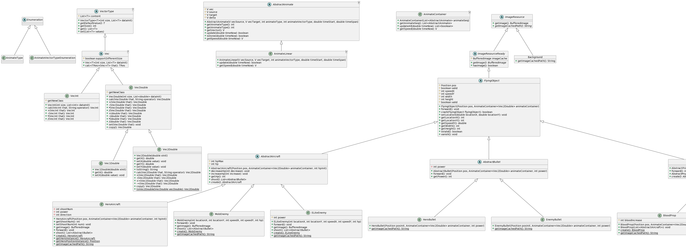
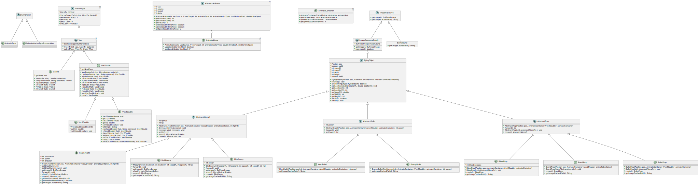
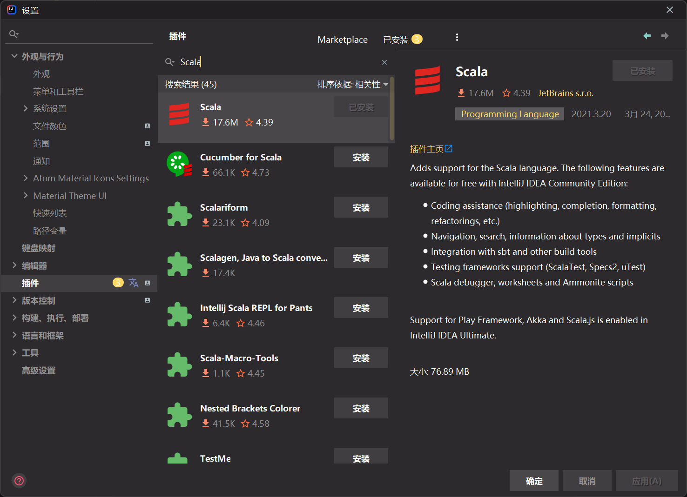
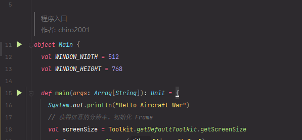
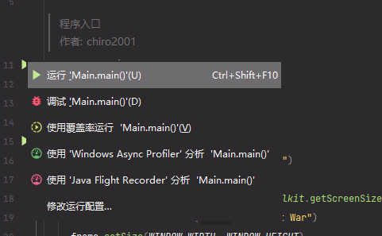

# Aircraft-War

## UML

见 [AicraftWar.puml](uml/AircraftWar-scala.puml)

*图片不够大...*

## 运行

### 直接运行编译好的 Jar 文件

如果您是助教，我已经将程序编译打包为单个`.jar`文件，直接双击 `run_jar.bat`即可运行。

### 运行主程序

1. 使用 IDEA 打开项目文件夹（即此 `README.md` 文件所在文件夹）

2. IDEA 安装 Scala 插件

   

3. 重启 IDEA 并且重新打开文件夹，等待 IDEA 加载 sbt 完成

4. 打开 `AircraftWar/src/main/scala/work/chiro/game/application/Main.scala`

5. 点击三角形运行

   

   

