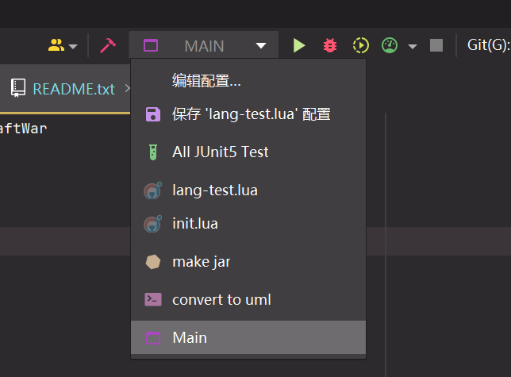

# Aircraft-War

[toc]

## 说明

本项目已分为 Scala、Java 两独立部分，Java 部分完成课程基本要求，Scala 部分想在完成课程基础上做点奇怪东西……

Java 部分为 master 分支，Scala 部分为 scala 分支。

## UML

Scala 项目的 UML 图见 [AircraftWar-scala.puml](uml/AircraftWar-scala.puml)，Java 项目的 UML 图见 [AircraftWar-java.puml](uml/AircraftWar-java.puml)。

## 运行

### 注意事项

2. **加载 SBT 项目需要稳定的互联网连接以加载外部依赖！**

   详见：[(44条消息) sbt卡住的解决办法，sbt设置代理_ArkFallen的博客-CSDN博客_sbt 代理](https://blog.csdn.net/baidu_33340703/article/details/105548180)

   如果您没有稳定的网络代理的话，删除 `build.sbt`再用 IDEA 打开也可以加载项目；或者直接运行 `.jar` 文件也可以。

### 操作说明

1. 鼠标拖动或者方向键（`↑/↓/←/→`）移动英雄机
2. `z`键发射子弹
3. 按下`shift`可以减慢移动速度（微操）

### 直接运行编译好的 Jar 文件

如果您是助教，我已经程序编译打包为单个`.jar`文件，直接双击 `run_jar.bat`即可运行。

编译好的 Jar 文件放在 `/target/scala-2.13/aircraft-war-${version}.jar`。

### 运行

1. 使用 IDEA 打开项目文件夹（即此 `README.md` 文件所在文件夹）

2. 等待 IDEA 加载 sbt 完成

3. 如果运行配置中有这一项

   1. 运行这一项（`Main`）即可

4. 如果运行配置中没有这一项

   1. 打开 `src/main/java/edu/hitsz/application/Main.java`

   2. 点击三角形运行

      

