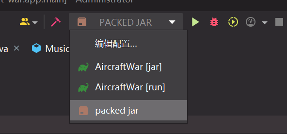
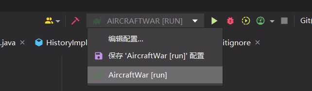
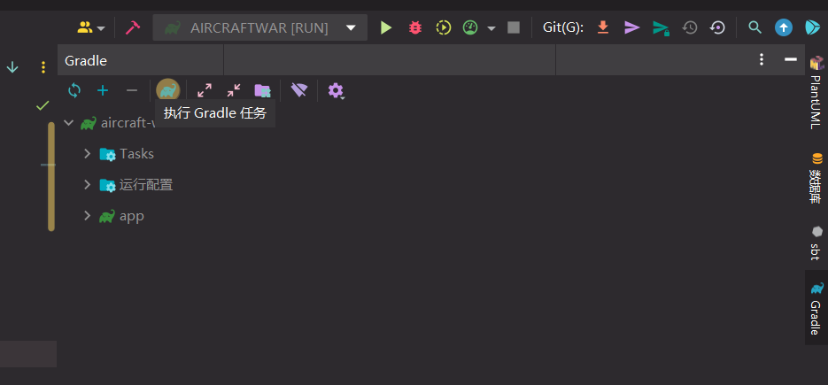
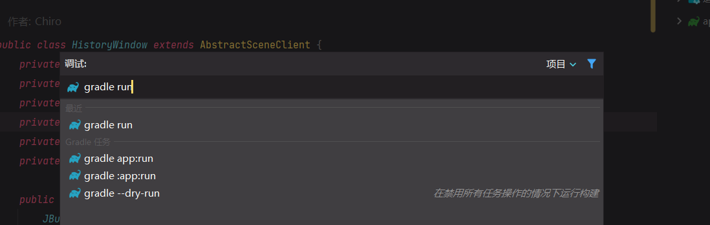

# Aircraft-War

[toc]

## 说明

本项目已分为 Scala、Java 两独立部分，Java 部分完成课程基本要求，Scala 部分想在完成课程基础上做点奇怪东西……

Java 部分为 master 分支，Scala 部分为 scala 分支。

以下为 Java 部分的说明。

## UML

UML 图见 [AircraftWar-java.puml](uml/AircraftWar-java.puml)。

## 运行

### 注意事项

1. 本项目使用 Gradle 管理，使用 IDEA 打开项目工程时请加载 Gradle 项目。

### 操作说明

1. 鼠标拖动或者方向键（`↑/↓/←/→`）移动英雄机
2. `z`键发射子弹
3. 按下`shift`可以减慢移动速度（微操）
4. 英雄机判定点不是整个飞机，而是飞机中间的小点，方便操作

### 直接运行编译好的 Jar 文件

如果您是助教，我已经程序编译打包为单个`.jar`文件，直接双击 `run_jar.bat`即可运行。

编译好的 Jar 文件放在 `app/build/libs/app.jar`。

或者在 IDEA 中运行 `packed jar` 也行。

### 运行

1. 使用 IDEA 打开项目文件夹（即此 `README.md` 文件所在文件夹）

2. 等待 IDEA 加载 Gradle 完成

3. 如果运行配置中有这一项

   1. 
   2. 运行这一项即可

4. 如果运行配置中没有这一项

   1. 打开右侧，点击执行 Gradle 任务

      

   2. 输入 `run` 运行

      

