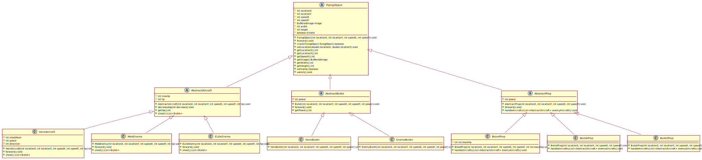
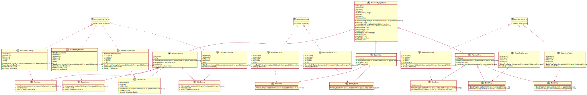
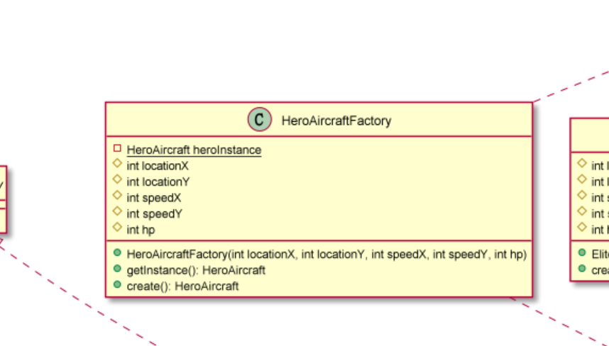

# 实验二报告

## UML 图

> 虽然导出为 SVG 格式，但是因为页面较宽，可能出现图片不清晰的情况，请打开`docs/lab02/*.puml`查看详图。

实验一的UML图如下：



实验二的UML图如下：



## 单例模式

### 应用场景分析

*描述飞机大战游戏中哪个应用场景需要用到此模式，目前实验一代码中存在的问题。*

 在本飞机大战应用中，英雄机（`HeroAircraft`）在整个程序运行过程中存在且只存在一个实体，故英雄机的创建适合使用单例模式创建。

 另外，因为每个游戏资源从磁盘只需要加载一次，所以每个游戏资源也可以使用单例模式来创建。

完成实验一后，`HeroAircraft`仍然从`Game`类中创建（~不过本人上交的代码实验一的时候已经使用了单例模式~），不符合单例模式，`client`端可能出现创建两个或者多个`HeroAircraft`的情况。

### 解决方案

*将PlantUML插件绘制的类图截图到此处，并对UML类图中每个类、接口，以及其关键属性和方法进行简单说明。*

对`HeroAircraft`应用单例模式。

涉及到的相关 UML 图部分：



对 `HeroAircraft`的创建者 `HeroAircraftFactory`，其`create()`以**双重检查锁定**的方式创建全局唯一的`HeroAircraft`对象。

```java
package edu.hitsz.aircraft;

import work.chiro.game.aircraft.AbstractAircraftFactory;
import work.chiro.game.aircraft.HeroAircraft;

public class HeroAircraftFactory implements AbstractAircraftFactory {
    protected int locationX, locationY, speedX, speedY, hp;

    public HeroAircraftFactory(int locationX, int locationY, int speedX, int speedY, int hp) {
        this.locationX = locationX;
        this.locationY = locationY;
        this.speedX = speedX;
        this.speedY = speedY;
        this.hp = hp;
    }

    // 全局唯一的 `HeroAircraft` 对象，由单例模式的双重检查锁定方法创建
    static private HeroAircraft heroInstance = null;

    // 获取实例
    static public HeroAircraft getInstance() {
        return heroInstance;
    }

    @Override
    public HeroAircraft create() {
        // Double-checked locking
        if (heroInstance == null) {
            synchronized (HeroAircraftFactory.class) {
                heroInstance = new HeroAircraft(locationX, locationY, speedX, speedY, hp);
            }
        }
        return heroInstance;
    }
}
```


## 工厂模式

### 应用场景分析

*描述飞机大战游戏中哪个应用场景需要用到此模式，目前实验一代码中存在的问题。*

在本飞机大战游戏中，每次飞机、子弹、道具的创建和使用，如果每次都去访问最末位的子类的方法，会大大增加程序复杂度，而且不符合开闭原则。应该应用工厂模式，用统一的接口限制其调用方式。

目前实验一的代码没有实现工厂模式，故本人在实验二中对所有的 `AbstractFlyingObject`的非抽象子类使用了抽象工厂模式。

### 解决方案

*将PlantUML插件绘制的类图截图到此处，并对UML类图中每个类、接口，以及其关键属性和方法进行简单说明。*

涉及的 UML 图：


`abstract class AbstractAircraft`、`abstract class AbstractProp`和`class BaseBullet `充当产品角色，`class *Aircraft`、`class *Bullet`和`class *Prop`充当具体产品角色。

工厂接口有三个：`interface AbstractAircraftFactory`、`interface BaseBulletFactory`和`interface AbstractPropFactory`，

具体工厂类为：`class *Factory`，充当具体创建者角色。

