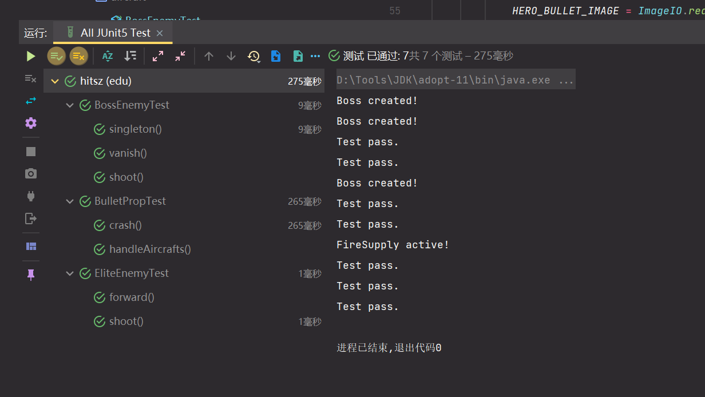
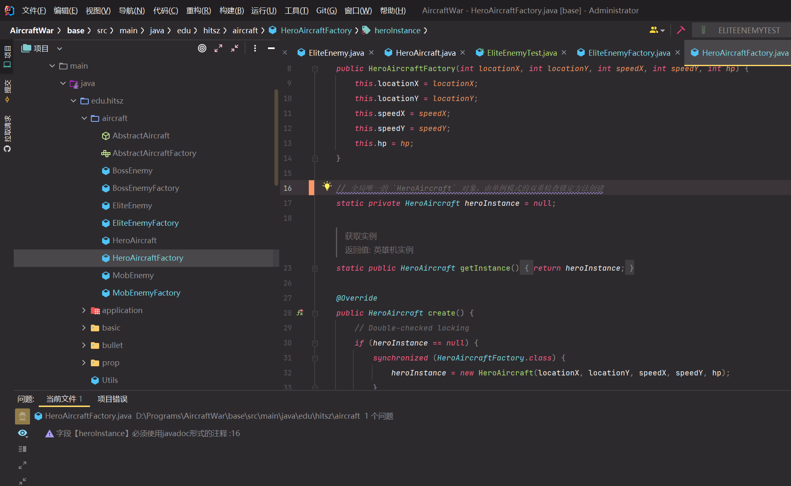
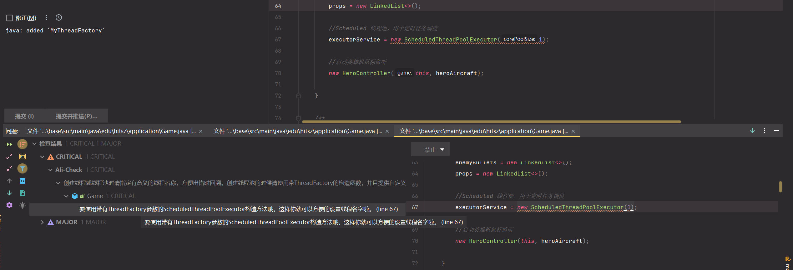
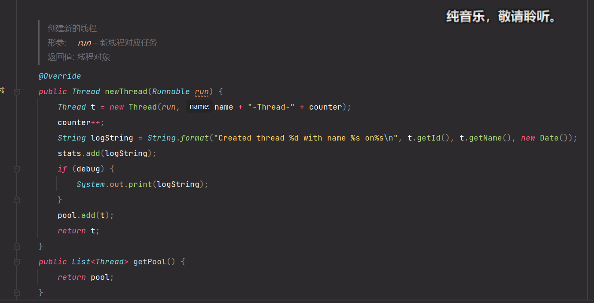
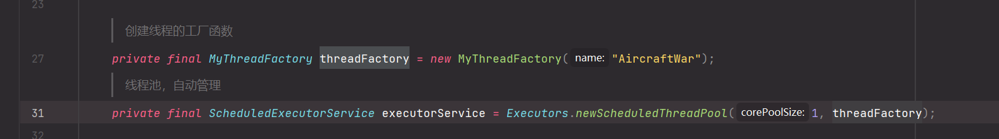

# 实验三报告

梁鑫嵘 200110619

## 单元测试

*结合飞机大战实例，在系统中选择英雄机、敌机、子弹和道具类的方法（包含其父类方法）作为单元测试的对象，为每个测试对象编写单元测试代码。要求至少选择3个类，每个类至少2个方法（**一个方法一个测试用例**），并截图JUnit单元测试的结果。*

### 测试用例

| 用例编号                                              | BossEnemy1                                     |                        |              |          |
| ----------------------------------------------------- | ---------------------------------------------- | ---------------------- | ------------ | -------- |
| 待测试类及方法                                        | `BossEnemy`                                    | `public void vanish()` |              |          |
| 测试类及方法                                          | `BossEnemyTest`                                | `void vanish()`        |              |          |
| 前提条件（如有）                                      | `BossEnemy `对象已经创建                       |                        |              |          |
| 用例描述                                              | 测试步骤                                       | 期望结果               | 实际输出     | 测试结果 |
| 测试`vanish()`是否能将`BossEnemy`对象变为`notValid`。 | 创建对象并调用`vanish()`，查看是否`notValid()` | `Test pass.`           | `Test pass.` | 通过     |

| 用例编号                              | BossEnemy2                                        |                                         |              |          |
| ------------------------------------- | ------------------------------------------------- | --------------------------------------- | ------------ | -------- |
| 待测试类及方法                        | `BossEnemy`                                       | `public LinkedList<BaseBullet> shoot()` |              |          |
| 测试类及方法                          | `BossEnemyTest`                                   | `void shoot()`                          |              |          |
| 前提条件（如有）                      | `BossEnemy `对象已经创建                          |                                         |              |          |
| 用例描述                              | 测试步骤                                          | 期望结果                                | 实际输出     | 测试结果 |
| 测试`shoot()`能否产生指定规格的子弹。 | 创建对象并调用`shoot()`，查看产生子弹的数量、规格 | `Test pass.`                            | `Test pass.` | 通过     |

| 用例编号                                 | BossEnemy3                                               |                             |              |          |
| ---------------------------------------- | -------------------------------------------------------- | --------------------------- | ------------ | -------- |
| 待测试类及方法                           | `BossEnemyFactory`                                       | `public BossEnemy create()` |              |          |
| 测试类及方法                             | `BossEnemyTest`                                          | `void singleton()`          |              |          |
| 前提条件（如有）                         | `BossEnemy `对象未创建                                   |                             |              |          |
| 用例描述                                 | 测试步骤                                                 | 期望结果                    | 实际输出     | 测试结果 |
| 测试`BossEnemyFactory`的单例模式是否正常 | 清除单例模式实例并且`create()`两次，查看是否返回同一对象 | `Test pass.`                | `Test pass.` | 通过     |

| 用例编号                     | EliteEnemy1                                           |                         |              |          |
| ---------------------------- | ----------------------------------------------------- | ----------------------- | ------------ | -------- |
| 待测试类及方法               | `EliteEnemy`                                          | `public void forward()` |              |          |
| 测试类及方法                 | `EliteEnemyTest`                                      | `void forward()`        |              |          |
| 前提条件（如有）             | `EliteEnemy `对象已经创建                             |                         |              |          |
| 用例描述                     | 测试步骤                                              | 期望结果                | 实际输出     | 测试结果 |
| 测试`EliteEnemy`移动是否正常 | 创建对象并调用`forward()`，查看移动后位置是否符合速度 | `Test pass.`            | `Test pass.` | 通过     |

| 用例编号                              | EliteEnemy2                                       |                                         |              |          |
| ------------------------------------- | ------------------------------------------------- | --------------------------------------- | ------------ | -------- |
| 待测试类及方法                        | `EliteEnemy`                                      | `public LinkedList<BaseBullet> shoot()` |              |          |
| 测试类及方法                          | `EliteEnemyTest`                                  | `void shoot()`                          |              |          |
| 前提条件（如有）                      | `EliteEnemy `对象已经创建                         |                                         |              |          |
| 用例描述                              | 测试步骤                                          | 期望结果                                | 实际输出     | 测试结果 |
| 测试`shoot()`能否产生指定规格的子弹。 | 创建对象并调用`shoot()`，查看产生子弹的数量、规格 | `Test pass.`                            | `Test pass.` | 通过     |

| 用例编号                                   | BulletProp1                                                  |                                                              |              |          |
| ------------------------------------------ | ------------------------------------------------------------ | ------------------------------------------------------------ | ------------ | -------- |
| 待测试类及方法                             | `BulletProp`                                                 | `public boolean crash(AbstractFlyingObject abstractFlyingObject)` |              |          |
| 测试类及方法                               | `BulletPropTest`                                             | `void crash()`                                               |              |          |
| 前提条件（如有）                           | `BulletProp `、`HeroAircraft`对象已经创建                    |                                                              |              |          |
| 用例描述                                   | 测试步骤                                                     | 期望结果                                                     | 实际输出     | 测试结果 |
| 测试英雄机与`BulletProp`的碰撞检测是否正常 | 在接近位置创建`BulletProp `、`HeroAircraft`对象，调用`crash()`查看两者是否碰撞 | `Test pass.`                                                 | `Test pass.` | 通过     |

| 用例编号                       | BulletProp2                                                  |                                                              |              |          |
| ------------------------------ | ------------------------------------------------------------ | ------------------------------------------------------------ | ------------ | -------- |
| 待测试类及方法                 | `BulletProp`                                                 | `public void handleAircrafts(List<AbstractAircraft> enemyAircrafts)` |              |          |
| 测试类及方法                   | `BulletPropTest`                                             | `void handleAircrafts()`                                     |              |          |
| 前提条件（如有）               | `BulletProp `、`HeroAircraft`对象已经创建                    |                                                              |              |          |
| 用例描述                       | 测试步骤                                                     | 期望结果                                                     | 实际输出     | 测试结果 |
| 测试`BulletProp`是否能正常生效 | 创建`BulletProp `、`HeroAircraft`对象，调用`handleAircrafts()`查看英雄机是否能同时发出两发子弹 | `Test pass.`                                                 | `Test pass.` | 通过     |

*用例编号：唯一标识测试用例的序号，一般是数字或模块名首字母大写+数字序号。*

*待测试类及方法：该用例所测试的类名和方法名*

*测试类及方法：相应的测试代码的类名和方法名*

*前提条件（如有）：执行该测试用例的前提条件，比如碰撞检测，需已创建英雄机和敌机（或道具）。*

*用例描述：用一句话简单总结该测试用例的用意和目的。*

*测试步骤：详细完整的操作过程描述。*

*期望结果：正常情况下的响应结果。*

*实际结果：程序通过测试步骤后实际的响应结果。*

*测试结果：通过或失败*

### JUnit单元测试结果

*请把JUnit每个测试类（包含多个方法）的运行结果截图。*

> 注：所有测试都在上面了。

## 二、 编码规约

*列举2个实验中使用到的阿里编码规约插件的例子，截图或文字描述插件扫描出的代码问题以及你是如何解决的。*

1. 

   阿里编码规约插件提示“未使用的 import”。解决：删除这个未使用的 import。

2. 

   阿里编码规约提示“字段【heroInstance】必须使用javadoc形式的注释”。解决：将行注释改为 JavaDoc 格式。

   
   
3. “要使用带有ThreadFactory参数的ScheduledThreadPoolExecutor构造方法哦，这样你就可以方便的设置线程名字啦。 (line 67)”

   

   解决：

   1. 添加了 `MyThreadFactory` 类作为生成新线程的工厂类；

   2. `MyThreadFactory`类中对线程进行命名等操作；

      

   3. 创建线程池的时候加上线程工厂参数。

      

