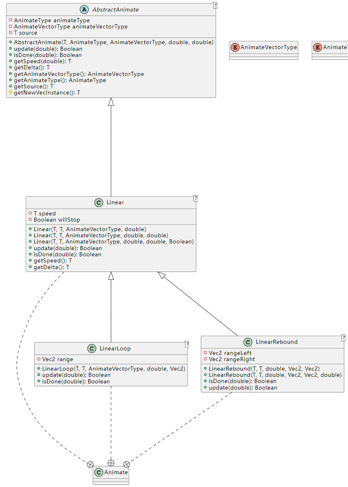
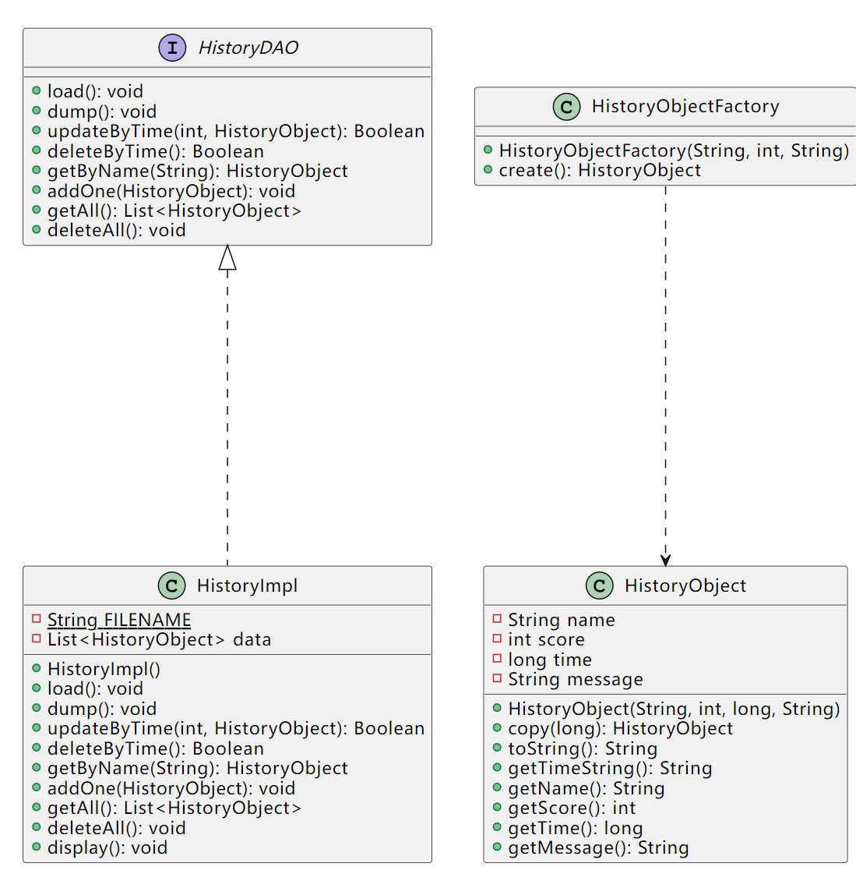

# 实验四报告

**UML 图：**

UML 类图见 `uml/AircraftWar-java.puml`，下面是 SVG 格式截图。截图较长，建议点击打开网页查看或者查看 PlantUML 文件。

[查看在线网页版本](https://www.plantuml.com/plantuml/svg/vLhVRziu4dxU_XK2yd0EuhP07XSBOvDjYWP8cqLYz6uV6Oc9UKkJEebkBbVqVp-A6ldJY6AaStf0WItGm9eVCzzy7FuGxLzh9ogts-fNVziuLzO_Ps_VbbgOHlGcjzktkHPr_RfGug4IsrUln5tjAf6xBCYpCtfyhv-KURY--wVqgg-lCl_lTVPPvgTPQMlbb3LzMQt-8yFpKLROtPsMsQCgt8QBDb8zR1p9pdVtzxAInULMFCXCDNyxZQXL_flG-axaVsRMV1P6rHlATfiB7wcoJWG8GNeo2dhH03kUCbXcPyOdT_8tQvnGHbO7k2m32GSxBjkgEl-Y4e-Buv-pBrOL9BgtrQEeYe6qbkvt6ej5I_4oK8rGUINgpM8Ca8zqPwsMmf3fWtHNDW-i_gF9euoBDNz4cjjIoY8MXr7rKZxCqF-zwOx8wqDe42usrdqMMXMB2F6Nq1S3JXx0YTS4Ug6viKwGfgKSgcjgCw_Y3TWhrVVuFkQtvCGvKvMd_TvbyjzEcY8vetuwGfMHSx9Vl4luisyMcLTIrF93kV3IY0ilZaOijvNaqgzTAT-oUcDj684hPVwKnPMgtI-U3tc-qrgwLUnGLBRytV-l1qvTHOtEkyLy8Ue4KpJpFToij8-o8WpmJv15FFr4JU4zkwezc1R31rdPv7YHWYC8_7pQRGb4By04Z6SdyYpIPp6DsZxQkmiZjqzJTPtiBN-m0YwqSd9U2R3zqOeujtKzhmQO_Z0bO9BmYOgv1_ImIi7733v6y53mP7IOpGqVhyweRSvwSy8yKaU5U3dS25DesOrjlM34Tk9LDsfe4srj4MEZz8GfR1Z-VxVYjzdXcsI6kn7gWw7QxTqKqXEoIc9wAORG2TCeOFUzSNXAPNKlSXdDv_V-iwsU20DhZcO4NBFtHaxHbiH2gMsfvLOQLqzaUvrzhPrmAl_6jxQDVxWqNcLoIR3YF7FM7SH_a8uYDWMnS4FJN4jHmPYjMA044G8TOpoyURDYPj4Y-nB2i58hnXGKBwS9iGxY2EwU8C02Ep1Wc-X1t61NdLywHmjt3nSFVRoGycFB8N3XUW3Ou4nGzt4056hCVEnJ0oH7yNjoV5uzVcvvW6twjMPq3urPGwo8BsbsMreYrq-bZBTQJYGimLuCsCFY4J3M4FSNkmE0HsvWD8sgxmHGaF8r7Pl9nDWc1v458T-HOOHcsAYDnL0sSc8OOIuD_uJvfQc3cSy85n070tuk-7_XeUW13X813Sdu0U4GEDmnYGTs7X5p0YQOeBNuvS8-RRKpY-YKupFxOCs4wx-2ugxj11OUKomATmNX9FCkt0gjZh6Q-6nCXIkb1I9qYA1ZqQ351Gc_MCY5pdlnbjbrAIlXdxmLnFtbg3CWMQbtDTrjZRbibNbMxzHMFgSlr1TLoAG1vOSqZG7YD0w8qrWcZEI_Ta8F8ftJhTX8tmowEzOieWFBVMMtOO2fVqQuyPdmqEzuI7iTJrAo-sMzwj24LAsI5xGcVMvB3n3FliK-oSV-8MdDYjw_2o0Qfdqd7Q6aFtTIamPelD44VbZ4YA5pzjPLoZmqqlRJeETWZIw357t5fEWaY1b9ftsM-YoSzcauZIwK9qi-ZNawnSh1us5bOHMVmetL33cgZkIe6meCGtEdJRaX_0F2v83nerQuDHvZC6Yy0tkQnrsmPUH1Dfkzu017y1Tfm62a0OTS1HOd2ICN_egyzkcg_Pv7xF6Ta0XkJRljZb9bnQuAz_PC6eeW2K-GywlxeEmOvAOqD1wIp7TEHbimMLlZAgirW66v32j5i5fbwykF5pUtoDhtNFJstg1gBz_WFLo72sk0Pw1JHdKjaR3ObOLmINzH58kGDQ7t6D-NDTlAeQG2tadj1Dh1KnOY-dqWgft8fCEitnl2JazFc0fS7YIfMpoomMRokk-M2No65ibWmz9JAsMrtLNTo_ymusAzx6TQHe6zQ7pbf14X8NRjLglgTzOajFYU3VerD3GGJ1QXQlIHCB8VM7ARsq0B4XtHtFVn4blobJ9IL7wGS4d7sSo-WlIcFdgYuhD7fVMjitJFIU6Q4LWdU0VVSwrVvhNie7xNGKuDhoUsXHVc687ZN5zPMuBlJig_lg-4sNyJ2w_9aeFpY-hq-94lNSEDlBCxKymguqhUkqXui_-LmGaF6Mha1Q6i-TQyPzBb9ga26SWsmiVmvHy4yDjfMWizjDMgMzOQ2m8GNoka5EcmhSiH5NEczQNn3YWgU59bj9F1TlwgvdFD-R8USu8vdA7q1M6w6Y_7av-WUFIARA_5WfXoN31RtbsrTBkosHflIs5GT29ItwcbASIQPN_JJ8F_rVvqsW5N88cxgSWLBuUHUV-0-47LZTsxi-izyzgAuRURnMvRSX4rsVcJfvNULobK-sLUr7E5r79lFzQHvq-VX5UrBsJUW8KZCr4KrqOkc2gw36aQlviPp7B5e90PFtKo-_siRp5bnkFhtmRbjkgUjVNwxbWCZwsiQ_pwXWMdGkbt9Ot_ahpOQw-s2J9Ihx4uwAQrWMZ8apzGGIml31WX_TYMXZ0HYPVRKlTl0T1gyM6U-7f_UNNnwUpZ1Qb7XZ0hX1E40ddyIFvrcvVagYwrU9fewS4gEwhadKabHMiGy_JPuaYq-d33NwNnuw7_2m00)


## 策略模式

### 应用场景分析

*描述飞机大战游戏中哪个应用场景需要用到此模式，目前代码实现中存在的问题及使用该模式的优势。*

在上一次实验中，在我们的飞机大战中的发射子弹部分，如果需要新增子弹运动轨迹，暂时无法将策略与结构分离。

于是，我们需要运用策略模式。使用策略模式可以将算法封装起来，使得算法之间可以互相替换，而且算法的变化不会影响到使用算法的客户。策略模式将实现算法的责任和算法的实现分割开，将算法具体实现委派给不同的对象进行管理。

### 解决方案

*借鉴策略模式的解题思路，设计解决该场景问题的方案。结合飞机大战实例，绘制具体的UML类图。*

1. *将 PlantUML 插件绘制的类图截图到此处（随代码也提交一份）*
2. *描述你设计的UML类图结构中每个角色的作用，并指出它关键的属性和方法。*

在本实验的代码中，本人将所有的物体的移动抽象为动画（`Animate`），即 `AbstractFlyingObject` 为 `Client`，`AnimateContainer` 为 `Context`，`AbstractAnimate` 是 `Strategy` 接口，`Animate.Linear`、`Animate.LinearLoop`、`Animate.LinearRebound`表示三种具体动画实现即 `ConcreteStratefies`。

**与移动方法的策略模式相关的类：**

1. `AbstractFlyingObject -> Client`

   

   `AbstractFlyingObject.forward()` 调用其 `animateContainer.updateAll()`，并判断当前物体的动画是否结束，动画结束则销毁物体。

   ```java
   abstract class AbstractFlyingObject {
   	public void forward() {
           if (animateContainer.updateAll(Utils.getTimeMills())) {
               vanish();
           }
       }
   }
   ```

   `AbstractFlyingObject` 作为策略使用的客户端。

2. `AnimateContainer -> Context`

   

   `AnimateContainer.animateList`是动画列表，即具体动画实现的储存变量。`AnimateContainer`中的内容当`AnimateContainer`类生成即确定。

   ```java
   /**
    * 动画容器，用于储存动画信息
    *
    * @author Chiro
    */
   public class AnimateContainer {
           /**
        * 调用所有动画，更新当前时间下的所有动画控制的所有变量。
        * @param timeNow 当前时间
        * @return 所有动画都结束了？
        */
       public Boolean updateAll(double timeNow) {
           List<Boolean> innerRes = updateAllInner(timeNow);
           return innerRes.stream().mapToInt(res -> res ? 0 : 1).sum() == 0;
       }
   }
   ```

   `AnimateContainer.updateAll()`在当前上下文执行所有策略。

3. `Animate.* -> ConcreteStratefies`

   `Animate` 类下有三个具体动画类，而其中又有继承关系来尽量复用所有代码。

   

   `Linear.update(double)`为更新当前动画控制的状态的函数，即具体策略的执行函数。

4. `AbstractAnimate -> Strategy`

   

   `AbstractAnimate`为策略接口，`AbstractAnimate.update(double)`为具体调用该策略的函数接口。

在实现动画的过程中，实现了 `Vec*` 类，方便向量运算以及对所有动画、位置变量使用泛型。使用泛型后可以方便地对更多的属性施加动画，如旋转角度、速度、碰撞盒大小等。

**与道具相关的策略模式的类：**`*Prop`


`AbstractProp.handleAircrafts()` 函数为策略接口和上下文（`Context`），`BombProp.handleAircrafts()`为具体策略位置。

## 数据访问对象模式

### 应用场景分析

*描述飞机大战游戏中哪个应用场景需要用到此模式，分析使用该模式的优势。*

飞机大战中历史记录的储存、读取等需要用到此模式。

1. 数据访问对象模式能够提供一个数据储存抽象层，隔离了数据访问业务代码和逻辑业务代码，使得代码分工更加明确，代码逻辑更加清晰，降低耦合。
2. 能够适配不同的数据储存读取具体实现，例如能够不加修改地从文件读写迁移到数据库读写，或者从此数据库迁移到其他数据库。

### 解决方案

*借鉴数据访问对象模式的解题思路，设计解决该场景问题的方案。结合飞机大战实例，绘制具体的UML类图。*

1. *将PlantUML插件绘制的类图截图到此处（随代码也提交一份）*
2. *描述你设计的UML类图结构中每个角色的作用，并指出它关键的属性和方法。*



1. `HistoryDAO`：数据访问对象接口

   提供了读写数据的接口。

2. `HistoryImpl`：数据访问对象实体类

   实现了上述的接口。

3. `HistoryObject`：模型对象

   描述了数据的结构。