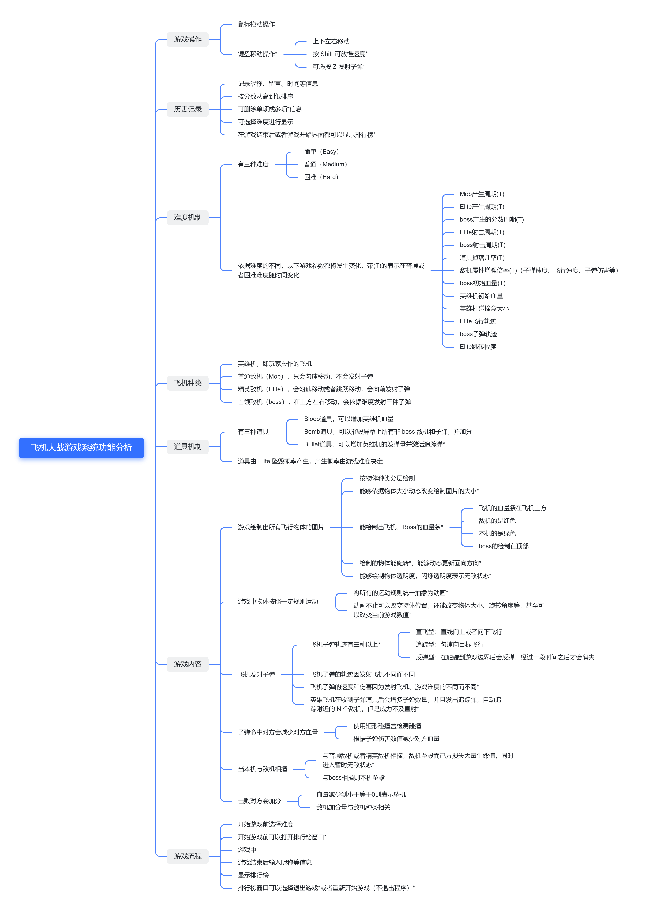

<h1>实验报告</h1>

| 开课学期 | <u>2022 春季</u>                    |
| -------- | ----------------------------------- |
| 课程名称 | <u>面向对象的软件构造导论</u>       |
| 实验名称 | <u>飞机大战游戏系统的设计与实现</u> |
| 实验性质 | <u>设计型</u>                       |
| 实验学时 | <u>16</u> 地点：<u>T2 608</u>       |
| 学生班级 | <u>计算机6班</u>                    |
| 学生学号 | <u>200110619</u>                    |
| 学生姓名 | <u>梁鑫嵘</u>                       |
| 评阅教师 |                                     |
| 报告成绩 |                                     |

## 实验环境

*请填写实验所用到的操作系统和主要开发工具。*

1. Windows 操作系统
2. Linux 操作系统
3. `AdoptOpenJDK (HotSpot)` version 11.0.11 
4. IntelliJ IDEA 2021.3.2 (Ultimate Edition)
5. `sbt`、`gradle` 构建工具
6. `Git` 项目管理工具
7. `JUnit Jupiter` 测试工具
8. Typora 文档记录工具
9. `PlantUML` IDEA UML 图绘制插件

## 实验过程

### 系统功能分析

## 类的继承关系分析

*请根据面向对象设计原则，分析和设计游戏中的所有飞机类、道具类和子弹类，并使用 PlantUML 插件绘制相应的 UML 类图及继承关系，类图中需包括英雄机、所有敌机、道具、子弹及它们所继承的父类。*

## 设计模式应用

### 单例模式

1. 应用场景分析

   *描述飞机大战游戏中哪个应用场景需要用到此模式，设计中遇到的实际问题，使用该模式解决此问题的优势。*

2. 设计模式结构图

   *结合飞机大战实例，绘制该场景下具体的解决方案（UML类图）。描述你设计的UML类图结构中每个角色的作用，并指出它的关键属性和方法。*

### 工厂模式

1. 应用场景分析

   *描述飞机大战游戏中哪个应用场景需要用到此模式，设计中遇到的实际问题，使用该模式解决此问题的优势。*

2. 设计模式结构图

   *结合飞机大战实例，绘制该场景下具体的解决方案（UML类图）。描述你设计的UML类图结构中每个角色的作用，并指出它的关键属性和方法。*

### 策略模式

1. 应用场景分析

   *描述飞机大战游戏中哪个应用场景需要用到此模式，设计中遇到的实际问题，使用该模式解决此问题的优势。*

2. 设计模式结构图

   *结合飞机大战实例，绘制该场景下具体的解决方案（UML类图）。描述你设计的UML类图结构中每个角色的作用，并指出它的关键属性和方法。*

### 数据访问对象模式

1. 应用场景分析

   *描述飞机大战游戏中哪个应用场景需要用到此模式，设计中遇到的实际问题，使用该模式解决此问题的优势。*

2. 设计模式结构图

   *结合飞机大战实例，绘制该场景下具体的解决方案（UML类图）。描述你设计的UML类图结构中每个角色的作用，并指出它的关键属性和方法。。*

### 观察者模式

1. 应用场景分析

   *描述飞机大战游戏中哪个应用场景需要用到此模式，设计中遇到的实际问题，使用该模式解决此问题的优势。*

2. 设计模式结构图

   *结合飞机大战实例，绘制该场景下具体的解决方案（UML类图）。描述你设计的UML类图结构中每个角色的作用，并指出它的关键属性和方法。*

### 模板模式

1. 应用场景分析

   *描述飞机大战游戏中哪个应用场景需要用到此模式，设计中遇到的实际问题，使用该模式解决此问题的优势。*

2. 设计模式结构图

   *结合飞机大战实例，绘制该场景下具体的解决方案（UML类图）。描述你设计的UML类图结构中每个角色的作用，并指出它的关键属性和方法。*

 

 

## 收获和反思

*请填写本次实验的收获，记录实验过程中出现的值得反思的问题及你的思考。*

*欢迎为本课程实验提出宝贵意见！*

