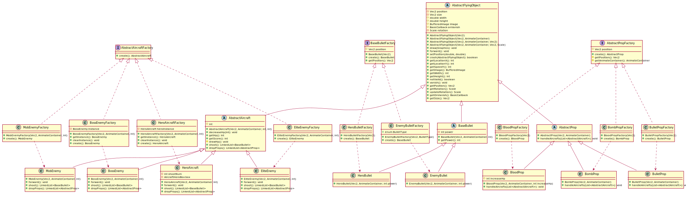
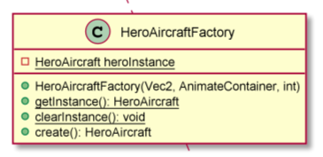
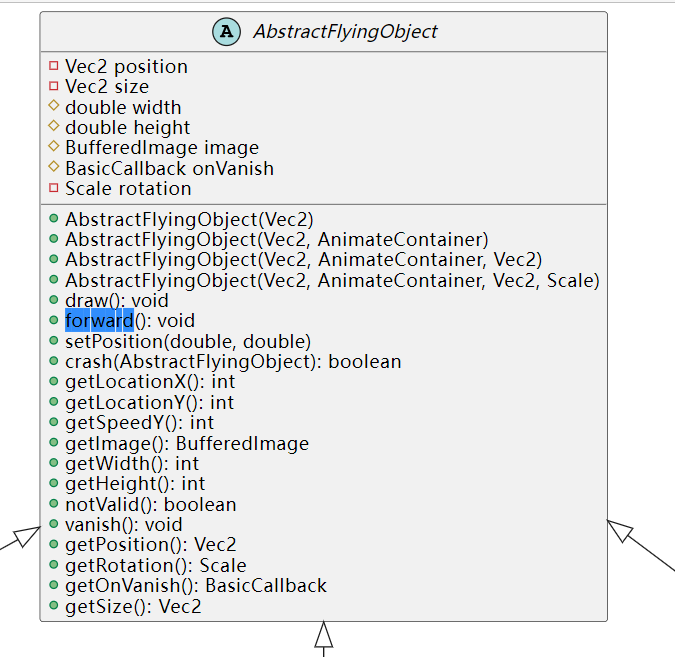
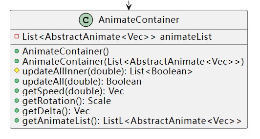
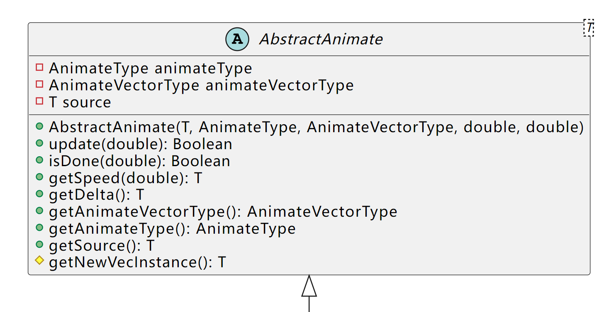
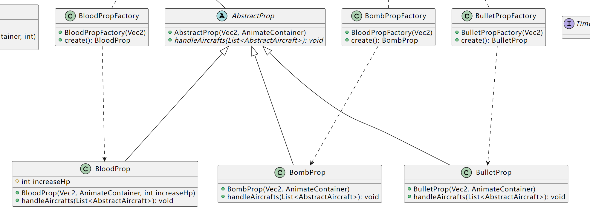
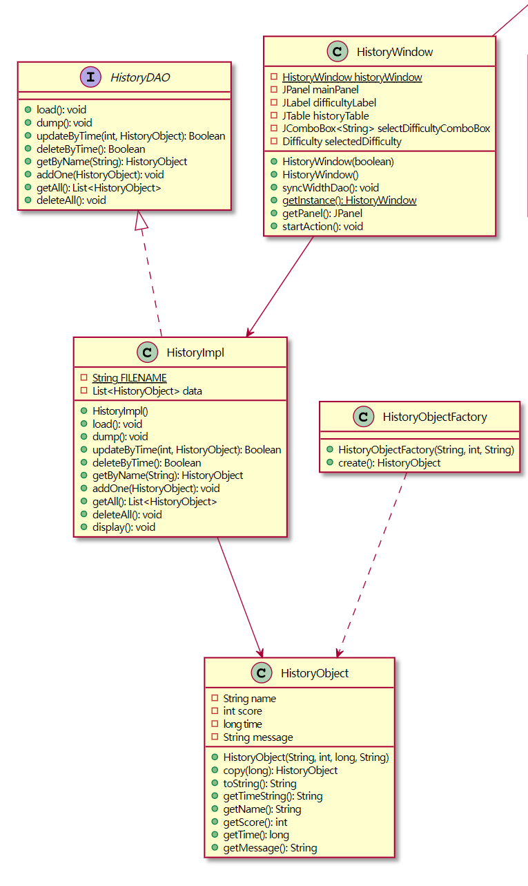

<center><h1>实验报告</h1></center>

| 开课学期 | <u>2022 春季</u>                    |
| -------- | ----------------------------------- |
| 课程名称 | <u>面向对象的软件构造导论</u>       |
| 实验名称 | <u>飞机大战游戏系统的设计与实现</u> |
| 实验性质 | <u>设计型</u>                       |
| 实验学时 | <u>16</u> 地点：<u>T2 608</u>       |
| 学生班级 | <u>计算机6班</u>                    |
| 学生学号 | <u>200110619</u>                    |
| 学生姓名 | <u>梁鑫嵘</u>                       |
| 评阅教师 |                                     |
| 报告成绩 |                                     |


## 实验环境

*请填写实验所用到的操作系统和主要开发工具。*

1. Windows 操作系统
2. Linux 操作系统
3. `AdoptOpenJDK (HotSpot)` version 11.0.11 
4. IntelliJ IDEA 2021.3.2 (Ultimate Edition)
5. `sbt`、`gradle` 构建工具
6. `Git` 项目管理工具
7. `JUnit Jupiter` 测试工具
8. Typora 文档记录工具
9. `PlantUML` IDEA UML 图绘制插件

## 实验过程

### 系统功能分析


## 类的继承关系分析

*请根据面向对象设计原则，分析和设计游戏中的所有飞机类、道具类和子弹类，并使用 PlantUML 插件绘制相应的 UML 类图及继承关系，类图中需包括英雄机、所有敌机、道具、子弹及它们所继承的父类。*

*图片请放大查看。*

**全部 UML 图：**


**飞机、道具、子弹类 UML 图：**



**分析：**

1. 各个飞机、道具、子弹类有层层继承的关系，如具体飞机 `*Aircraft` 继承于 `AbstractAircraft`，而 `Abstract*` 又继承于 `AbstractFlyingObject`。
2. 飞机、道具、子弹这几种具体类使用抽象工厂模式方法构建，以飞机类为例，即 `*Aircraft` 由 `*AircraftFactory` 创建，而 `*AircraftFactory` 又实现了 `AbstractAircraftFactory` 接口。其他类也一样。
3. 使用工厂模式可以避免创建者和具体产品之间的强耦合关系，并且符合单一职责原则、开闭原则，使得项目代码更加有条理。
4. 但是，使用抽象工厂模式会引入许多新的子类，使得代码更加复杂。

## 设计模式应用

### 单例模式

1. 应用场景分析

    在本飞机大战应用中，英雄机（`HeroAircraft`）在整个程序运行过程中存在且只存在一个实体，故英雄机的创建适合使用单例模式创建。

    另外，因为每个游戏资源从磁盘只需要加载一次，所以每个游戏资源也可以使用单例模式来创建。

   完成实验一后，`HeroAircraft`仍然从`Game`类中创建，不符合单例模式，`client`端可能出现创建两个或者多个`HeroAircraft`的情况。

   此外，在本项目的其他位置也使用了单例模式，如 Boss 机实例、三个显示窗口 `*Window` 实例、读写历史记录的 `HistoryImpl` 等。

2. 设计模式结构图

   
   
   以 `HeroAircraft` 的单例模式为例，在其创建者角色 `HeroAircraft` 中实现了静态的 `getInstance()`，并使用一个 `private` 的静态变量储存 `heroInstance` 实例，并提供一个 `clearInstace()` 方法清除实例以重新开始游戏。
   
   其核心代码如下：
   
   ```java
   	// HeroAircraftFactory.java:16
   	/**
        * 全局唯一的 `HeroAircraft` 对象，由单例模式的双重检查锁定方法创建
        */
       static private HeroAircraft heroInstance = null;
   
       /**
        * 获取实例
        *
        * @return 英雄机实例
        */
       static public HeroAircraft getInstance() {
           return heroInstance;
       }
   
       public HeroAircraftFactory clearInstance() {
           heroInstance = null;
           return this;
       }
   
       @Override
       public HeroAircraft create(AbstractConfig config) {
           // Double-checked locking
           if (heroInstance == null) {
               synchronized (HeroAircraftFactory.class) {
                   heroInstance = new HeroAircraft(
                           config,
                           new Vec2(Constants.WINDOW_WIDTH / 2.0,
                           Constants.WINDOW_HEIGHT - ImageManager.HERO_IMAGE.getHeight()),
                           new AnimateContainer(), new Vec2(config.getHeroBoxSize(), config.getHeroBoxSize()),
                           config.getHeroInitialHp());
               }
           }
           return heroInstance;
       }
   ```

### 工厂模式

1. 应用场景分析

   在本飞机大战游戏中，每次飞机、子弹、道具的创建过程中，如果每次都去访问最末位的子类的构造方法，会大大增加程序复杂度，而且不符合开闭原则。应该应用工厂模式，用统一的接口限制其创建方式。

   实验一的代码没有实现工厂模式，故在实验二中对所有的 `AbstractFlyingObject`的非抽象子类使用了抽象工厂模式。

2. 设计模式结构图

   
   
   `abstract class AbstractAircraft`、`abstract class AbstractProp`和`class BaseBullet `充当产品角色，`class *Aircraft`、`class *Bullet`和`class *Prop`充当具体产品角色。
   
   工厂接口有三个：`interface AbstractAircraftFactory`、`interface BaseBulletFactory`和`interface AbstractPropFactory`，
   
   具体工厂类为：`class *Factory`，充当具体创建者角色。
   

### 策略模式

1. 应用场景分析

   在实验二、实验三中，在我们的飞机大战中的发射子弹部分，如果需要新增子弹运动轨迹，暂时无法将策略与结构分离。

   于是，我们需要运用策略模式。使用策略模式可以将算法封装起来，使得算法之间可以互相替换，而且算法的变化不会影响到使用算法的客户。策略模式将实现算法的责任和算法的实现分割开，将算法具体实现委派给不同的对象进行管理。

2. 设计模式结构图

   在本实验的代码中，本人将所有的物体的移动抽象为动画（`Animate`），即 `AbstractFlyingObject` 为 `Client`，`AnimateContainer` 为 `Context`，`AbstractAnimate` 是 `Strategy` 接口，`Animate.Linear`、`Animate.LinearLoop`、`Animate.LinearRebound`表示三种具体动画实现即 `ConcreteStratefies`。
   
   **与移动方法的策略模式相关的类：**
   
   1. `AbstractFlyingObject -> Client`
   
      
   
      `AbstractFlyingObject.forward()` 调用其 `animateContainer.updateAll()`，并判断当前物体的动画是否结束，动画结束则销毁物体。
   
      ```java
      abstract class AbstractFlyingObject {
      	public void forward() {
              if (animateContainer.updateAll(Utils.getTimeMills())) {
                  vanish();
              }
          }
      }
      ```
   
      `AbstractFlyingObject` 作为策略使用的客户端。
   
   2. `AnimateContainer -> Context`
   
      
   
      `AnimateContainer.animateList`是动画列表，即具体动画实现的储存变量。`AnimateContainer`中的内容当`AnimateContainer`类生成即确定。
   
      ```java
      /**
       * 动画容器，用于储存动画信息
       *
       * @author Chiro
       */
      public class AnimateContainer {
              /**
           * 调用所有动画，更新当前时间下的所有动画控制的所有变量。
           * @param timeNow 当前时间
           * @return 所有动画都结束了？
           */
          public Boolean updateAll(double timeNow) {
              List<Boolean> innerRes = updateAllInner(timeNow);
              return innerRes.stream().mapToInt(res -> res ? 0 : 1).sum() == 0;
          }
      }
      ```
   
      `AnimateContainer.updateAll()`在当前上下文执行所有策略。
   
   3. `Animate.* -> ConcreteStratefies`
   
      `Animate` 类下有三个具体动画类，而其中又有继承关系来尽量复用所有代码。
   
      
   
      `Linear.update(double)`为更新当前动画控制的状态的函数，即具体策略的执行函数。
   
   4. `AbstractAnimate -> Strategy`
   
      
   
      `AbstractAnimate`为策略接口，`AbstractAnimate.update(double)`为具体调用该策略的函数接口。
   
   在实现动画的过程中，实现了 `Vec*` 类，方便向量运算以及对所有动画、位置变量使用泛型。使用泛型后可以方便地对更多的属性施加动画，如旋转角度、速度、碰撞盒大小等。
   
   **与道具相关的策略模式的类：**`*Prop`
   
   
   
   `AbstractProp.handleAircrafts()` （或在更新的代码中为 `update()`）函数为策略接口和上下文（`Context`），`BombProp.handleAircrafts()` （或在更新的代码中为 `update()`）为具体策略位置。

### 数据访问对象模式

1. 应用场景分析

   飞机大战中历史记录的储存、读取等需要用到此模式。

   1. 数据访问对象模式能够提供一个数据储存抽象层，隔离了数据访问业务代码和逻辑业务代码，使得代码分工更加明确，代码逻辑更加清晰，降低耦合。
   2. 能够适配不同的数据储存读取具体实现，例如能够不加修改地从文件读写迁移到数据库读写，或者从此数据库迁移到其他数据库。

2. 设计模式结构图

   
   
   1. `HistoryDAO`：数据访问对象接口
   
      提供了读写数据的接口。
   
   2. `HistoryImpl`：数据访问对象实体类
   
      实现了上述的接口。
   
   3. `HistoryObject`：模型对象
   
      描述了数据的结构。

### 观察者模式

1. 应用场景分析

   在飞机大战游戏中，炸弹道具的效果是清除屏幕上所有非 Boss 敌机，并且清除所有的敌方子弹。这就要求在 `BombProp` 主体内完成清除敌机和子弹的操作，而在 `BombProp` 中直接访问 `Game` 中的敌机、子弹实体是违反开闭原则的。于是我们需要一种设计模式可以“通知”到 `Game` 中的对应实体，完成销毁动作。

   于是我们可以使用观察者模式对 `AbstractProp` 进行改进，对 `enemyAircrafts` 和 `enemyBullets` 进行“观察”，以完成“通知”到它们的操作。

2. 设计模式结构图

   

### 模板模式

1. 应用场景分析

   *描述飞机大战游戏中哪个应用场景需要用到此模式，设计中遇到的实际问题，使用该模式解决此问题的优势。*

2. 设计模式结构图

   *结合飞机大战实例，绘制该场景下具体的解决方案（UML类图）。描述你设计的UML类图结构中每个角色的作用，并指出它的关键属性和方法。*

 

 

## 收获和反思

*请填写本次实验的收获，记录实验过程中出现的值得反思的问题及你的思考。*

*欢迎为本课程实验提出宝贵意见！*

