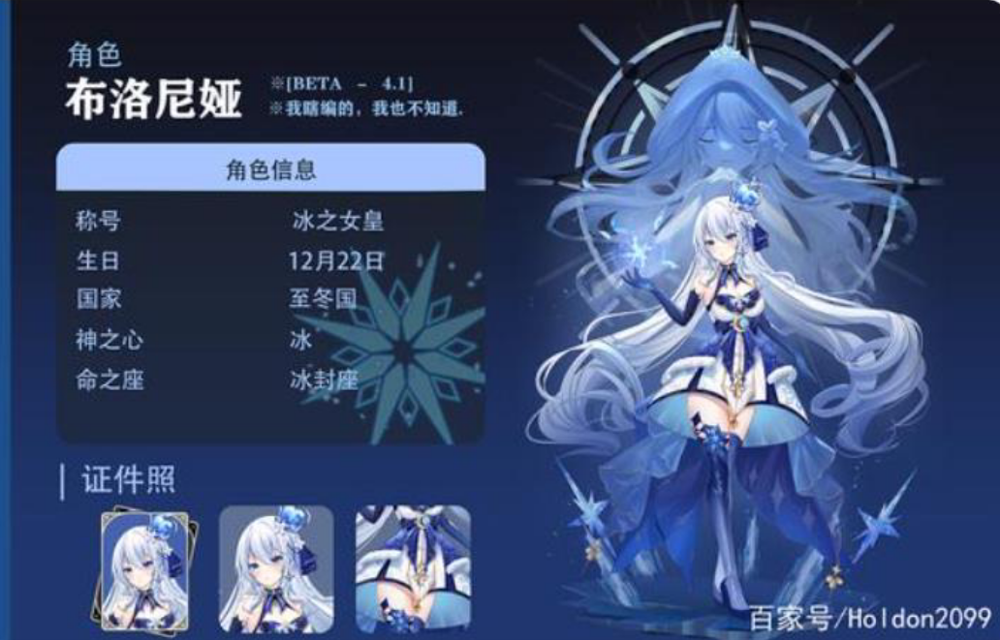

# 原神飞机大战主线剧情 v0.1

——丑角的阴谋/布洛妮娅的觉醒

（视频展示）放女士死亡 cg：
（画面展示）
......我死了？
......雷神杀了我？怎么会？她也背叛天理了吗？
......雷神怎么了？

（图片不用放）

我是冰之女皇的法杖，或者说，我是布洛妮娅。我作为冰神，和七神与天理一起，在 500 年前覆灭了坎瑞亚。在战争胜利后，我收留了当时坎瑞亚在至冬的外交使者——皮耶罗。没想到的是，皮耶罗在我疗伤之时，袭击了我，想要灭杀天理，覆灭七国，重新建立坎瑞亚的国度。而我则不得已使用秘法，进入到冰之女皇的权杖之中，成为现在的我。而皮耶罗借助坎瑞亚的魔偶技术，创造了现在坐在台上的冰之女皇，成为了他执掌冰之国度的傀儡。同时他还改变了冰之国度的信仰，从爱变成了不爱，想要慢慢吞噬掉冰之国度与其余六国。同时创建愚人众，监察各国。

百年前，已经创建了愚人众，成为了【丑角】的皮耶罗，遇到了炎之魔女——那想要用鲜血与火焰洗涤世间污秽的少女。

那位爱唱歌的少女，在得知蒙德城鲁斯坦死讯时已经死去，剩下的空壳中只有对深渊的仇恨。【丑角】皮耶罗用冰之女皇的权杖治愈了炎之魔女，但是【丑角】皮耶罗没想到的是，醒过来的少女不再是炎之魔女，而是寄宿在冰之女皇法杖中的冰神——布洛妮娅。

我成为了【女士】，但是碍于丑角的力量，我没办法阻止他的阴谋。无奈之下，只得作为至冬国的外交使臣出使国外。同时在面见神灵时，故意做出高傲的样子，同时显露部分冰之女皇的力量，给他们示警。没想到，巴巴托斯和摩拉克斯能领会到我的意图，雷神巴尔泽布却直接杀了我，道？雷神不再追随天理了吗？
不过幸好，跟随【丑角】这些年，我也学到了不少的玩偶技术，还可以重新制作出一个玩偶出来，附魂上去。

（此处可以捏脸/）

（制作完成）

我的这个新玩偶就叫做（String name=）吧
此处好像是在稻妻的社奉行府邸，首先先想办法先利用人偶杀出社奉行吧
（开始剧情游戏）

关卡 1（体验游戏）
过了大厅，出门就可以离开社奉行了。

关卡 2（boss1：神里绫华/神里绫人开情况选择），在 boss 手下撑过 300s
终于撑过来了，神里一家果然恐怖，不过也在战斗中得到了他们的数据，只要想办法经历一下他们的过去，再由足够的材料，想必就可以制造他们的玩偶了吧（开启玩偶系统（选角色系统））

开启支线剧情 1——神里绫华/神里绫人的记忆。
稻妻都在雷神治下，或许雷神已经背叛天理，得想办法先回到璃月或者蒙德，通知巴巴托斯和摩拉克斯这个消息。

开启主线剧情 1——雷神的背叛？
关卡 xxxx
被通缉，打三奉行，最终通过坐船逃回璃月

开启主线剧情 2——璃月的旅行
关卡 xxxx
找到钟离，并与之交谈，发现钟离放权给了七星，钟离本身就不想管事情，所以让冰之女皇去找巴巴托斯或者七星，但是因为冰之女皇不知道七星态度，所以决定去蒙德找巴巴托斯

开启主线剧情 3——蒙德的回忆
关卡 xxxx
与巴巴托斯交谈，但是因为巴巴托斯崇尚的是自由，同时因为冰之女皇受到【女士】残魂的影响，对巴巴托斯印象很不好，打一架后各自散开，同时这是冰之女皇力量恢复的差不多了，于是准备回到稻妻，探查雷神是否真的背叛了稻妻。

开启主线剧情 4——雷神的救赎
关卡 xxxx
各种潜伏然后和雷神打了一架，把真正雷神的打了出来，发现之前杀女士的是玩偶，于是误会解开。洗白雷神，同时听从雷神的建议去枫丹寻求帮助。

开启主线剧情 5——枫丹求援