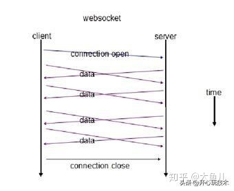

# 面向对象报告

[toc]

## 面向对象分析

### 需求模型

### 基本模型

子项目基本依赖模型：

测试项目依赖模型：

项目 UML 图：

因为在导论课程之后对整个项目进行了重写并且新增了较多的内容，故 UML 图内容较多。

### 辅助模型

## 系统设计方案

### 客户端、服务端方案

本项目使用客户端、服务端方案，服务端负责管理用户数据等，客户端通过服务端进行通信。

客户端方面，本项目的客户端是电脑或者手机上运行的 ReSignora 游戏客户端程序，是基于 Java 语言和 JVM 虚拟机的 WebSocket 客户端；服务端是基于 Rust 语言、Actor 处理模型、WebSocket 通信协议的服务器程序。

客户端和服务端之间的通信数据结构是 JSON。

#### WebSocket 客户端

在本项目中使用 `java-websocket` （https://github.com/TooTallNate/Java-WebSocket）作为客户端网络协议库。这是一个完全由 Java 实现的 WebSocket 客户端/服务端，可以完美地运行在任何 JVM 虚拟机之上。

#### Actor 模型

Actor模型是一个概念模型，用于处理并发计算，它定义了一系列系统组件应该如何动作和交互的通用规则。

一个 Actor 指的是一个最基本的计算单元，它能接收一个消息并且基于其执行计算。Actors 之间相互隔离，它们并不互相共享内存。这点区别于面向对象编程中的对象。也就是说，一个 Actor 能维持一个私有的状态，并且这个状态不可能被另一个 Actor 所改变。

当一个 actor 接收到消息后，它能做如下三件事中的一件：

- Create more actors; 创建其他actors
- Send messages to other actors; 向其他actors发送消息
- Designates what to do with the next message. 指定下一条消息到来的行为

Actor 模型让它能够自然地拥有分布式计算、高容错、冗余计算等等特性，是开发游戏后端的一种方便而自然的软件模型。但是因为其 Actors 之间不能改变互相的状态，其数据一致性无法保证，并不是一个强数据一致性模型，这对整个系统的数据架构提出了较高的要求。

基于其弱数据一致性的特性，后端实现了两个客户端之间的数据转发，客户端对战完成之后才通知后端的数据。

Rust 后端使用的 Actor 模型方案是 `actix-web-actors`，使用的 WebSocket Server 方案是 `actix-web`。

### JSON

客户端使用 Gson 对各种数据的 Beans 进行序列化，服务端使用 `serder` 对 JSON 信息进行编码解码处理。

使用 JSON 这种通信方案，是因为客户端和服务端对 JSON 的序列化、反序列化都有很好的支持，并且其轻量化的数据特点也适合于 WebSocket 传输。

### 网络通信方案

本程序使用基于 WebSocket 的网络通信协议，实现了两玩家的对战交互。WebSocket 的通信逻辑大致如下图所示：

WebSocket 是类似 Socket 的 TCP 长连接的通讯模式，一旦 WebSocket 连接建立后，后续数据都以帧序列的形式传输；流的分包、可靠性由 WebSocket 协议保证。

### 数据储存方案

客户端在本地使用 SharedPreferens 储存对战数据，后端因为其弱数据一致性，暂时存储在内存中。

### 系统兼容设计方案

本程序使用了一个游戏兼容层来实现让 PC 端和 Android 端运行同一个游戏逻辑。

这个游戏兼容层包括游戏资源的兼容、绘图方式的兼容、玩家操作的兼容等等。通过将游戏中需要调用的资源进行抽象和分析，分离出 Android 和 PC 上游戏资源的不同的逻辑，从而实现了多端协同。由此，玩家可以在 PC 和 Android 之间任意互联。

除了资源的兼容，本游戏客户端架构还支持一套自己的 UI 系统和生命周期系统。每一个界面都由属于其自身的 `XView` 和公共的 `XView` 组成，每一个 `XView` 和 `XLayout` 都有其生命周期和事件系统，其行为类似于 Android 的 View，但是能够兼容在 Swing AWT 上运行。

## 调试分析

1. 问题一：Java 2D 绘图性能问题
   1. 问题表述：在实现 PC 端绘图功能时，因为需要对图像进行许多旋转、缩放操作，Java 2D 的性能不足以满足绘图要求。
   2. 解决措施：
      1. 在 AWT 启动时设置硬件加速，启动 `OpenGL` 加速，设置图像格式、抗锯齿等
      2. 减少 `BufferedImage` 的使用，尽量使用有硬件加速功能的 `VolatileImage` 
2. 问题二：Android Canvas 绘图性能问题
   1. 问题表述：Android 端的绘图仍然不能满足需求
   2. 解决措施：
      1. 升级到更高版本的 Android SDK
      2. 启用 `surfaceHolder.lockHardwareCanvas()`

## 系统核心功能运行结果与分析

## 总结

